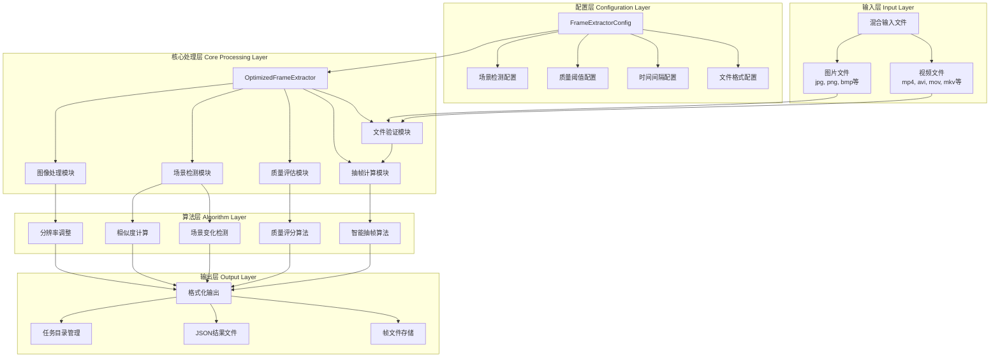
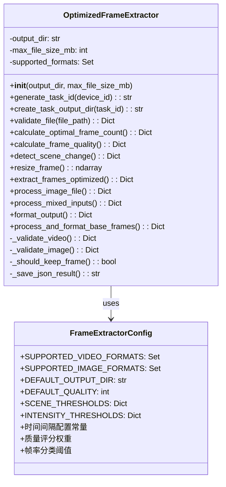
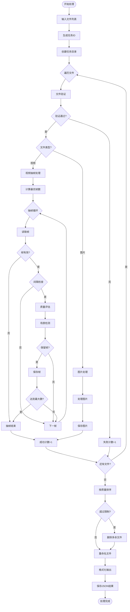
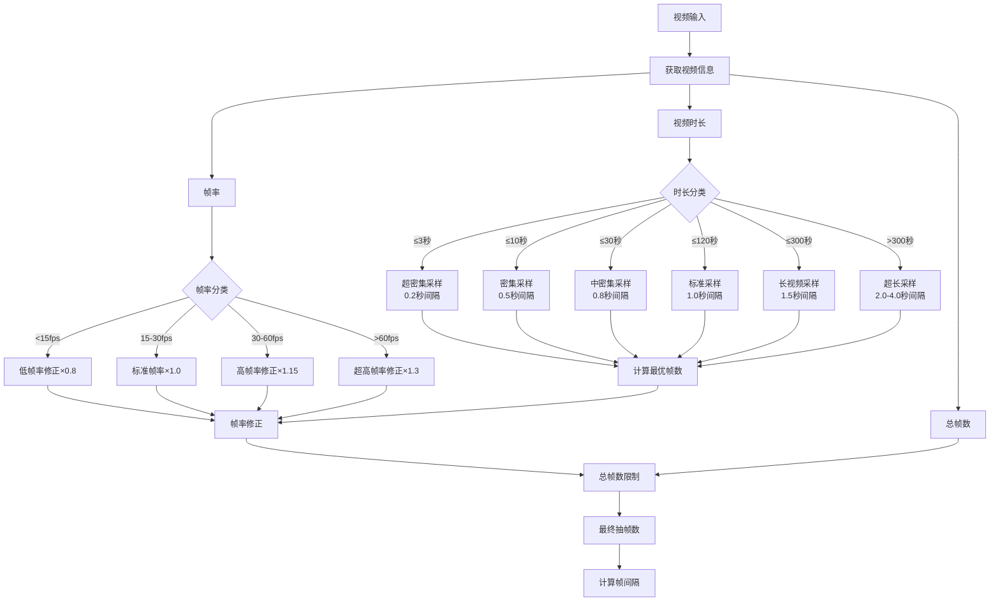
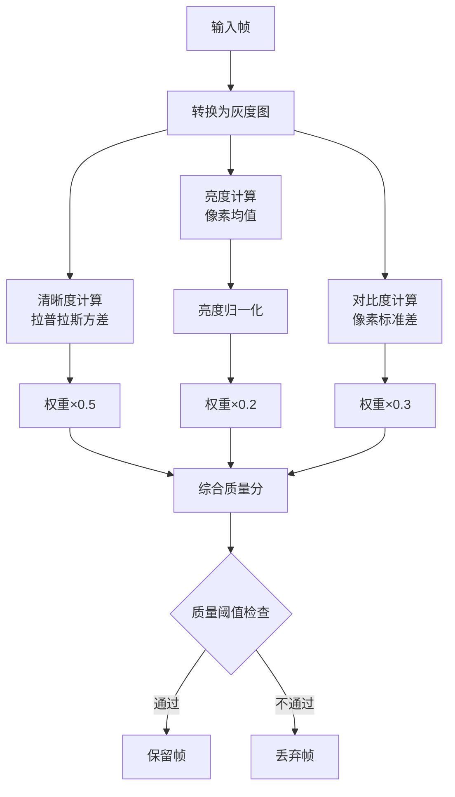
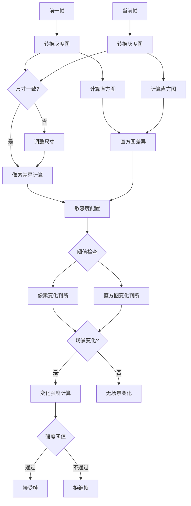
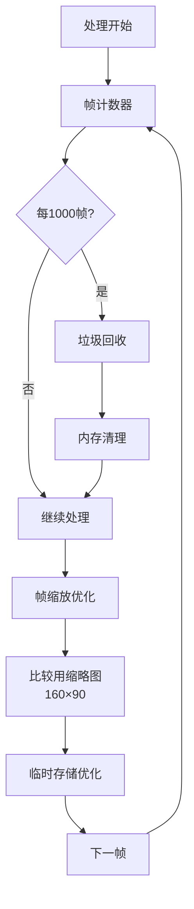
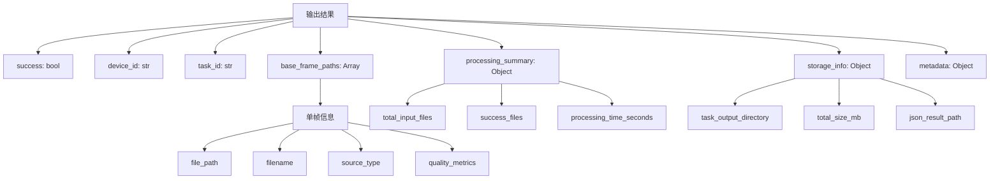

# 优化版视频抽帧系统架构图

## 系统整体架构

## 核心类结构图

## 数据流程图

## 智能抽帧算法流程

## 质量评估系统

## 场景变化检测算法

## 内存优化策略

## 输出格式结构

## 性能优化特性

### 1. 配置驱动设计
- 所有硬编码值提取为配置常量
- 支持不同场景的参数调优
- 灵活的阈值配置系统

### 2. 智能抽帧策略
- 基于视频时长的自适应间隔
- 帧率感知的修正因子
- 质量驱动的帧选择

### 3. 内存管理优化
- 定期垃圾回收机制
- 缩略图比较减少内存占用
- 流式处理避免大量数据缓存

### 4. 并发处理能力
- 支持混合输入批量处理
- 任务级别的目录隔离
- 独立的错误处理机制

### 5. 质量保证系统
- 多维度质量评估
- 场景变化智能检测
- 相似度过滤机制

这个架构图展现了优化版抽帧系统的完整设计思路，从输入处理到输出格式化的全流程，以及各个模块之间的协作关系。系统采用了模块化设计，具有良好的可扩展性和维护性。