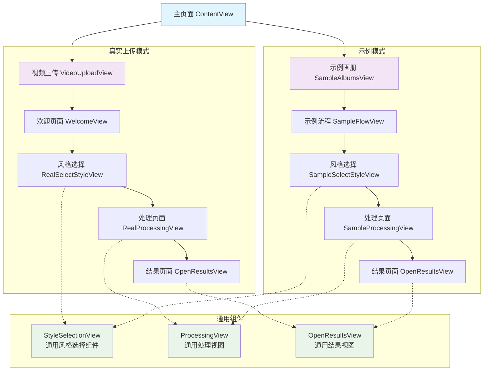

# 帧织者APP架构图

```mermaid
graph TD

A[主页面 ContentView] --> B[视频上传 VideoUploadView]
A --> C[示例画册 SampleAlbumsView]

subgraph "真实上传模式"
    B --> D[欢迎页面 WelcomeView]
    D --> E[风格选择 RealSelectStyleView]
    E --> F[处理页面 RealProcessingView]
    F --> G[结果页面 OpenResultsView]
end

subgraph "示例模式"
    C --> H[示例流程 SampleFlowView]
    H --> I[风格选择 SampleSelectStyleView]
    I --> J[处理页面 SampleProcessingView]
    J --> K[结果页面 OpenResultsView]
end

subgraph "通用组件"
    L[StyleSelectionView<br/>通用风格选择组件]
    M[ProcessingView<br/>通用处理视图]
    N[OpenResultsView<br/>通用结果视图]
end

E -.-> L
I -.-> L
F -.-> M
J -.-> M
G -.-> N
K -.-> N

style A fill:#e1f5fe
style B fill:#f3e5f5
style C fill:#f3e5f5
style L fill:#e8f5e8
style M fill:#e8f5e8
style N fill:#e8f5e8

```

