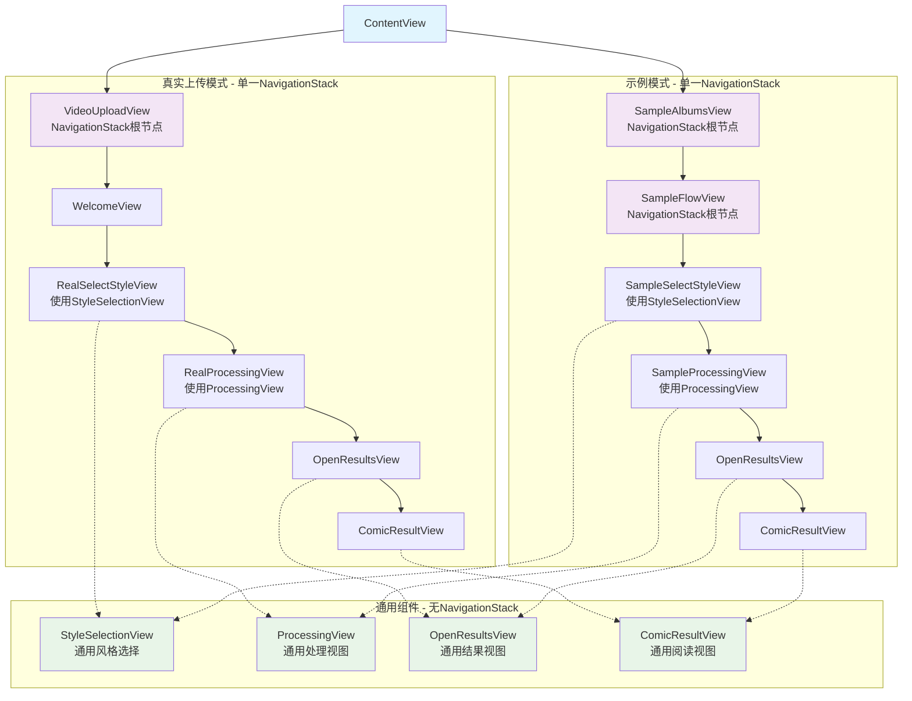

# 帧织者APP架构图

```mermaid
graph TD

    A[ContentView] --> B[VideoUploadView<br/>NavigationStack根节点]
    A --> C[SampleAlbumsView<br/>NavigationStack根节点]
    
    subgraph "真实上传模式 - 单一NavigationStack"
        B --> D[WelcomeView]
        D --> E[RealSelectStyleView<br/>使用StyleSelectionView]
        E --> F[RealProcessingView<br/>使用ProcessingView]
        F --> G[OpenResultsView]
        G --> H[ComicResultView]
    end
    
    subgraph "示例模式 - 单一NavigationStack"
        C --> I[SampleFlowView<br/>NavigationStack根节点]
        I --> J[SampleSelectStyleView<br/>使用StyleSelectionView]
        J --> K[SampleProcessingView<br/>使用ProcessingView]
        K --> L[OpenResultsView]
        L --> M[ComicResultView]
    end
    
    subgraph "通用组件 - 无NavigationStack"
        N[StyleSelectionView<br/>通用风格选择]
        O[ProcessingView<br/>通用处理视图]
        P[OpenResultsView<br/>通用结果视图]
        Q[ComicResultView<br/>通用阅读视图]
    end
    
    E -.-> N
    J -.-> N
    F -.-> O
    K -.-> O
    G -.-> P
    L -.-> P
    H -.-> Q
    M -.-> Q
    
    style A fill:#e1f5fe
    style B fill:#f3e5f5
    style C fill:#f3e5f5
    style I fill:#f3e5f5
    style N fill:#e8f5e8
    style O fill:#e8f5e8
    style P fill:#e8f5e8
    style Q fill:#e8f5e8
```

